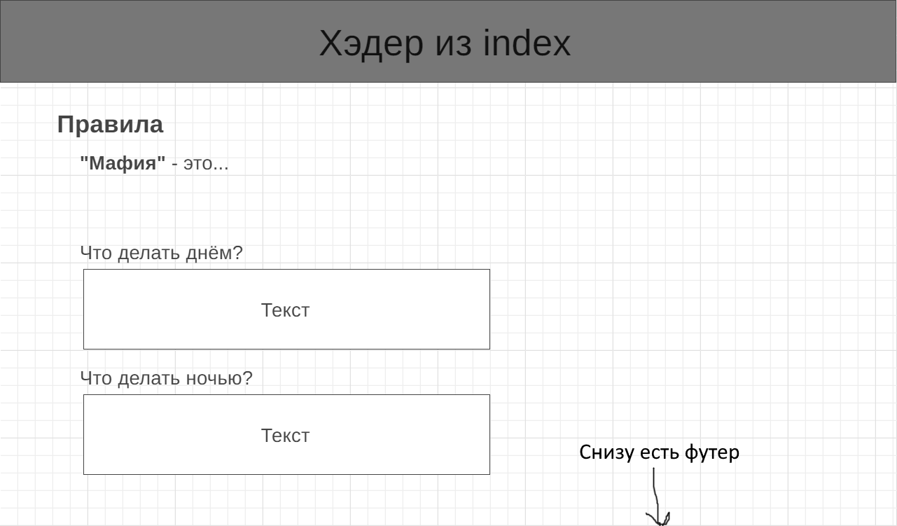

# Mafia
Онлайн версия клубной командной психологической пошаговой ролевой игры "Мафия"

Ознакомиться с проектом можно [здесь](https://den26012002.github.io/Mafia) 

## Что будет в проекте

### Главная страница
Большой присветсвенный баннер будет объяснять для чего нужен этот сайт и приглашать к игре:

### Игровой процесс
Игрок может присоединиться к существующей игре по её коду:

Или создать свою собственную игру:

После этого он попадёт в комнату ожидания:

А затем и в игровую:

После игры появится сообщение о победителе:

### Правила

Если пользователь никогда раньше не участвовал в игре в "Мафию" или хочет вспомнить как играть, то он может зайти на страницу с правилами:

А также узнать обо всех поддерживаемых игровых персонажах на другой специальной странице:

## Автор
**Денис Мельник**

**ИТМО**, группа: **M33001**, номер ИСУ: **311474**

Телеграм: [@den26012002](t.me/den26012002)